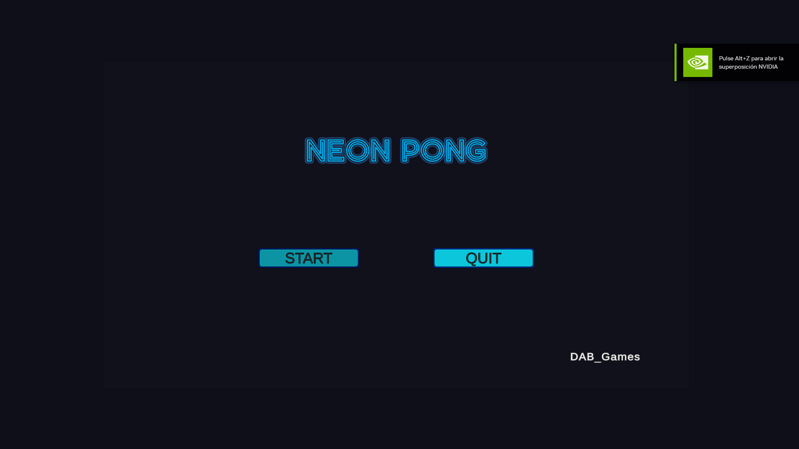
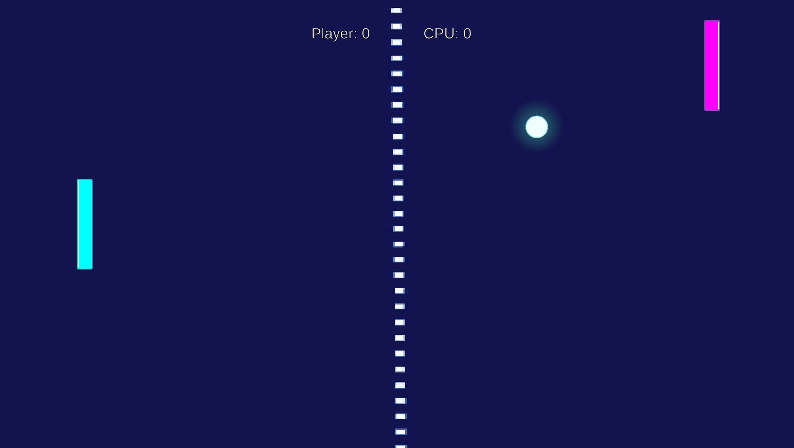
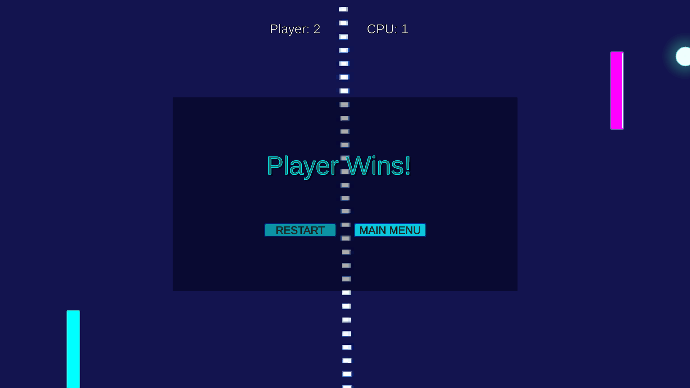
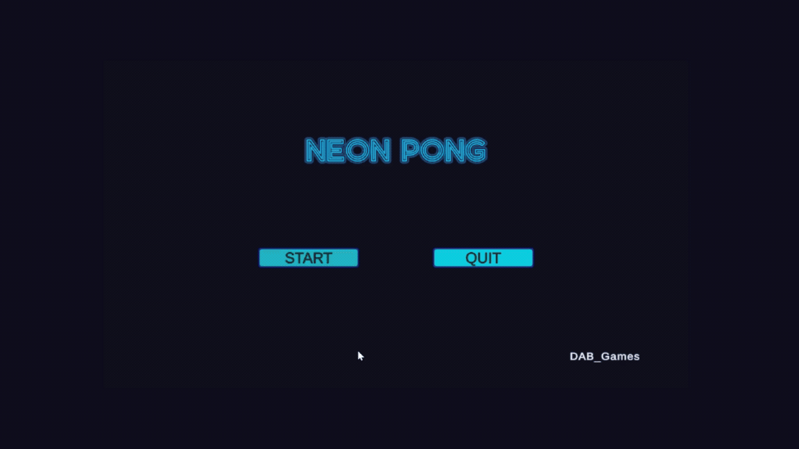

Neon Pong

A modern take on the classic Pong game, built in Unity with a focus on clean architecture, responsive gameplay, and polished UI feedback.

---

Features

Classic Pong gameplay (Player vs AI)
Increasing ball speed for dynamic difficulty
AI opponent with prediction and reaction system
Pause system with full UI navigation (keyboard support)
Game Over system with restart and main menu
UI sound feedback (click & hover)
Polished UI with interactive buttons and animations

---

Controls

| Action      | Input        |
| ----------- | ------------ |
| Move Paddle | W / S or ↑ ↓ |
| Pause       | ESC          |
| UI Navigate | Arrow Keys   |
| Select      | Enter        |

---

Tech & Concepts

This project was built as part of a structured learning path focused on game development fundamentals:

* Unity (2D)
* New Input System
* Game State Management (Playing / Paused / Game Over)
* Basic AI (prediction + reaction time)
* UI Navigation with EventSystem
* Separation of concerns (GameManager, UIManager, Ball, Paddle)

---

Architecture Overview

The project is structured around clear system responsibilities:

* 'GameManager' → Core game flow, score, and state control
* 'UIManager' → UI updates, menus, and navigation
* 'Ball' → Movement, collisions, and scoring triggers
* 'Paddle' → Player input and movement
* 'PaddleAI' → AI movement and prediction

---
Preview

---

How to Play

1. Clone the repository
2. Open in Unity (recommended version: 2022+)
3. Load the main scene
4. Press Play

---

Notes

This project is part of a personal challenge to build multiple small games while focusing on clean architecture and gameplay fundamentals.

---

Author

**DAB_Games**

---
